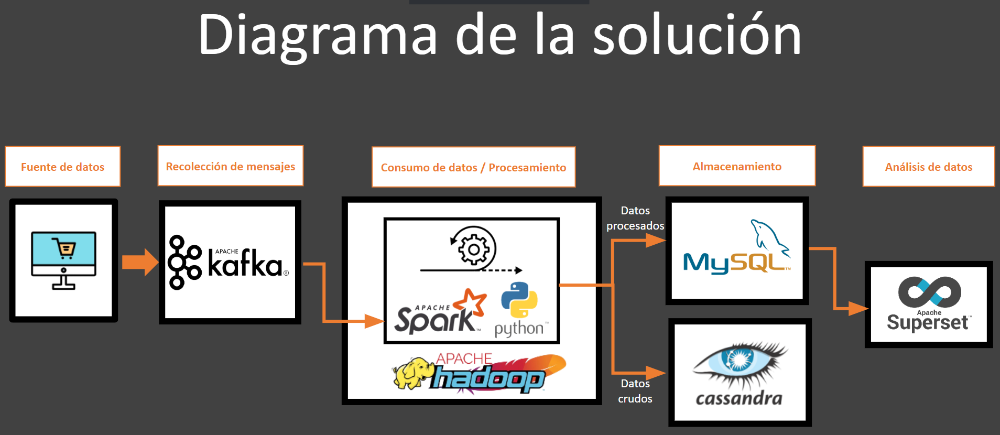

# Arquitectura de un pipeline de Big Data para el tratamiento de datos en tiempo real

El presente trabajo corresponde al proyecto final de la asignatura de Big Data impartida por el Dr. Juan Pablo Soto Barrera en el semestre 2022–1 y que forma parte del conjunto de materias optativas de la [Maestría en Ciencia de Datos de la Universidad de Sonora](https://mcd.unison.mx/).

Equipo:

* [Pedro Andrés Hernández Amador](https://www.linkedin.com/in/pedro-hdez/)
* [Benjamín López Mendoza](https://www.linkedin.com/in/benjamin-lopez-mendoza-531b7248/)
* [Adrián Emilio Vázquez Icedo](https://github.com/adrianEVI)

El objetivo de este proyecto es **crear un pipeline utilizando herramientas optimizadas y libres para la recolección, tratamiento, almacenamiento y análisis de grandes volúmenes de datos en tiempo real**. En nuestro proyecto trabajaremos con un subconjunto de datos referente al comportamiento de los usuarios de una tienda en línea y que han sido recuperados desde [este dataset de Kaggle](https://www.kaggle.com/datasets/mkechinov/ecommerce-behavior-data-from-multi-category-store?select=2019-Nov.csv).

Los datos se obtendrán utilizando **Apache Kafka**; el procesamiento y limpieza de datos se realizará con **Apache Spark** (PySpark) que se ejecutará sobre **Apache Hadoop**; despues el almacenamiento se realizará en dos formas: los datos crudos se cargarán a una base de datos NoSQL con **ApachAe Cassandra** y la información procesada se guardará en una base de datos SQL utilizando **MySQL**. Este doble almacenamiento tiene como objetivo mantener la información histórica original en caso de que en un futuro sea necesario un procesamiento diferente al que se aplicará sobre los datos almacenados en MySQL, además de que este último gestor es más apropiado para ejecutar operaciones transaccionales y de lectura/escritura recurrentes. Adicionalmente, se configurará **Apache Hive** en caso de que alguna aplicacion requiera almacenar los datos sobre el sistema de archivos de Hadoop. Finalmente, se creara un dashboard sencillo con **Apache Superset** para analizar la informacion recolectada. Todas las herramientas se instalarán sobre **Ubuntu 20.04** ya sea para Windows con WSL o sobre la distribución nativa.

* [Guía de instalación](https://medium.com/mcd-unison/arquitectura-de-un-pipeline-de-big-data-para-el-tratamiento-de-datos-en-tiempo-real-parte-1-e2d4a5d4b632)
* [Guía de ejecución](https://medium.com/mcd-unison/arquitectura-de-un-pipeline-de-big-data-para-el-tratamiento-de-datos-en-tiempo-real-parte-2-d50998658029)

