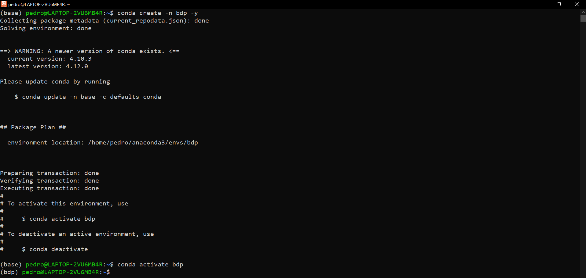
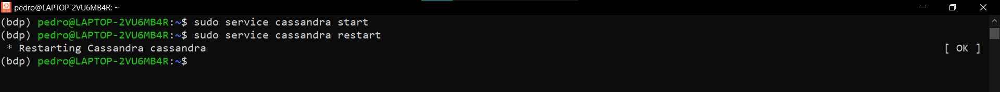

# Instalar Hadoop

Actualizaremos todo el software del sistema con `sudo apt update -y`. Esto podría tomar algunos minutos.

Después correremos `sudo apt upgrade -y`

Luego ejecutar el comando `sudo apt autoremove -y`

Ahora configuraremos el servicio ssh e esta forma Hadoop y toodos los softwares necesarios tendrán acceso a los puertos.

Primero, reinstalamos openssh-server:
`sudo apt remove openssh-server -y`
`sudo apt install openssh-server -y`

e iniciamos el servicio de ssh: `sudo service ssh start`

Ahora, creamos el directorio de ssh, el archivo de llaves autorizadas y otorgamos los permisos necesarios
`mkdir ~/.ssh`
`chmod 700 ~/.ssh`
`touch ~/.ssh/authorized_keys`
`chmod 640 ~/.ssh/authorized_keys`

Luego, entramos a la carpeta .ssh: `cd ~/.ssh`

Generamos las claves con `ssh-keygen` (Damos enter a todo para que la ejecución se realice con los parámetros por default)


Copiamos la clave generada al archivo `authorized_keys` con el comando `cat id_rsa.pub >> authorized_keys`

Ahora, recargamos el servicio de ssh con: `sudo service ssh reload`

Finalmente, creamos una conexión ssh con: `ssh localhost`


**Nota importante** A partir de aquí es necesario tener, en todo momento, una conexión ssh con localhost. En caso de que en algún momento cierres tu sesión en Ubuntu, deberás levantar de nuevo la conexión ssh con las siguientes dos instrucciones:

`sudo service ssh start`
`ssh localhost`

El siguiente paso es instalar Java con el comando: `sudo apt install openjdk-8-jdk -y`

Para verificar que se instaló correctamente corremos el comando `java -version` y deberíamos ver una salida como la siguiente:


Ahora, necesitamos añadir al archivo `~/.bashrc` la variable de entorno que representa a la ruta en donde se encuentran almacenados los archivos de Java. Éstos deberían encontrarse en la carpeta `/usr/lib/jvm/java-8-openjdk-amd64`. Para verificar que en efecto, los archivos se encuentran ahí, podemos enlistar el contenido de este directorio con el comando `ls /usr/lib/jvm/java-8-openjdk-amd64` y deberíamos obtener como salida lo siguiente:


Para añadir la variable de entorno abrimos el archivo con Vim utilizando el comando `vim ~/.bashrc`


Al presionar enter se abrirá el archivo en modo VISUAL:


Añadimos la variable de entorno escribiendo las siguientes dos líneas al final del archivo; puedes llegar rápidamente a la última línea teclenado `Shift+G` y después teclear `Shift+A` para ir al final de la línea y activar al mismo tiempo el modo INSERT

```bash
# Java environment variable
export JAVA_HOME=/usr/lib/jvm/java-8-openjdk-amd64
export PATH=$PATH:$JAVA_HOME/bin
```

Para guardar los cambios en el archivo primero hay que presionar `Esc` para regresar al modo VISUAL, después escribir `:x` y dar `Enter` para guardar las modificaciones y cerrar el archivo al mismo tiempo. Si estás en modo VISUAL puedes ver el comando que estás escribiendo en la esquina inferior izquierda:


Una vez realizado ésto hay que refrescar las variables de entorno del sistema con el comando `source ~/.bashrc`. Este comando no genera niguna salida.

Como siguiente paso, se va a crear la carpeta `softwares`en donde se almacenarán todos los programas que se van a descargar:

`mkdir softwares`

Podemos revisar que se haya creado con el comando `ls`


Procederemos a descargar Hadoop. A la fecha de la realización de este artículo, la versión más reciente es [Hadoop 3.2.3](https://www.apache.org/dyn/closer.cgi/hadoop/common/hadoop-3.2.3/hadoop-3.2.3.tar.gz). 

Copiamos el primer link de la página


y realizamos la descarga con el comando `wget`, además, especificaremos que el archivo se almacene en la carpeta `softwares` con el parámetro `-P`:

` wget -P softwares/ https://dlcdn.apache.org/hadoop/common/hadoop-3.2.3/hadoop-3.2.3.tar.gz`


Podemos verificar que el archivo se ha descargado si enlistamos el contenido de la carpeta `softwares` con el comando `ls softwares`:


Ahora, descomprimimos el archivo que hemos descargado con el comando `tar -xzvf softwares/hadoop-3.2.3.tar.gz  --directory softwares/`

Una vez ejecutado podemos confirmar que se ha creado una carpeta nueva usando otra vez el comando `ls softwares`:


Ahora, necesitamos configurar algunas variables de entorno para Hadoop. Al igual que las variables de Java, estas deberán incluirse en el archivo `~/.bashrc`. Primero, necesitamos conocer la ruta de la carpeta en donde se encuentran todos los archivos de Hadoop, es decir, la ruta de la carpeta que acabamos de descomprimir. Para conocerla debemos entrar a la carpeta `hadoop-3.2.3/` utilizando la instrucción `cd softwares/hadoop-3.2.3/`, una vez dentro ejecutamos el comando `pwd` y la ruta se mostrará en la consola:


Una vez conociendo la ruta de la carpeta de Hadoop procedemos a abrir el archivo `~/.bashrc` con la instrucción `vim ~/.bashrc` y añadimos las siguientes líneas al final del archivo (recuerda editar el valor de la primer variable `HADOOP_INSTALL` con la ruta que acabas de obtener con el comando `pwd`)

```bash
# HADOOP VARIABLES SETTINGS START HERE
export HADOOP_INSTALL=/home/pedro/softwares/hadoop-3.2.3
export PATH=$PATH:$HADOOP_INSTALL/bin
export PATH=$PATH:$HADOOP_INSTALL/sbin
export HADOOP_MAPRED_HOME=$HADOOP_INSTALL
export HADOOP_COMMON_HOME=$HADOOP_INSTALL
export HADOOP_HDFS_HOME=$HADOOP_INSTALL
export YARN_HOME=$HADOOP_INSTALL
export HADOOP_COMMON_LIB_NATIVE_DIR=$HADOOP_INSTALL/lib/native
export HADOOP_OPTS="-Djava.library.path=$HADOOP_INSTALL/lib"
export HADOOP_OPTS="-Djava.library.path=$HADOOP_COMMON_LIB_NATIVE_DIR"
# HADOOP VARIABLES SETTINGS END HERE
```


Una vez guardados los cambios refrescamos las variables de entorno del sistema con el comando `source ~/.bashrc`

Ahora, necesitamos editar el puerto de nuestro host. Para saber el nombre del host utilizamos el comando `hostname -f`


Ahora, abrimos con el editor de texto el archivo `/etc/hosts` con el comando `sudo vim /etc/hosts`


Podremos ver la etiqueta del host con el puerto `127.0.1.1`. Aquí necesitamos realizar un pequeño cambio, este es, cambiar el puerto al `127.0.0.1` y guardar los cambios.


Ahora necesitamos crear una carpeta auxiliar para Hadoop. Entramos a la carpeta de Hadoop con `cd ~/softwares/hadoop-3.2.3/` una vez ahí, crearemos la carpeta `hadoop_data` y dentro de esta crearemos los directorios `datanode`, `namenode` y `tmp` con los siguientes cuatro comandos:

```bash
mkdir hadoop_data
mkdir hadoop_data/datanode
mkdir hadoop_data/namenode
mkdir hadoop_data/tmp
```


Una vez ejecutados, podemos confirmar que se han creado con el comando `ls -R ~/softwares/hadoop-3.2.3/hadoop_data`.

Ahora necesitamos editar algunos archivos de configuración de Hadoop. Para ello, primero hay que desplazarnos hacia la carpeta `softwares/hadoop-3.2.3/etc/hadoop`, podemos lograrlo con la instrucción `cd ~/softwares/hadoop-3.2.3/etc/hadoop/`. Si utilizamos el comando `ls` dentro de dicha carpeta podremos ver todos los archivos de configuración:


El primer archivo a editar será `core-site.xml` así que lo abrimos con el editor de texto utilizando el comando `vim core-site.xml` y veremos las etiquetas `<configuration></configuration>` vacías:


Rellenaremos estas etiquetas con dos propiedades, una para especificar la ruta en donde Hadoop creará archivos temporales (carpeta `tmp` recién creada) y la otra para establecer el puerto para el sistema de archivos. Entonces, reemplazamos las etiquetas vacías con lo siguiente (recuerda editar la ruta a la carpeta `hadoop_data/tmp`)

```xml
<configuration>
    <property>
        <name>hadoop.tmp.dir</name>
	    <value>/home/pedro/softwares/hadoop-3.2.3/hadoop_data/tmp</value>
	    <description>Parent directory for other temporary directories.</description>
    </property>   
    <property>
        <name>fs.defaultFS</name>
	    <value>hdfs://localhost:9000</value>
	    <description>The name of the default file system.</description>
    </property>
</configuration>
```

Guardamos los cambios y cerramos el archivo


Ahora, necesitamos editar el archivo `hdfs-site.xml`; de nuevo, al abrirlo podrás notar las etiquetas `<configuration></configuration>` vacías. Aquí especificaremos la ruta a los directorios para el **namenode** y para el **datanode**, que son las carpetas auxiliares que creamos hace un momento y que se encuentran dentro del directorio `hadoop_data`; además, configuraremos el factor de replicación, esto es, el número total de copias de cada archivo en el Hadoop File System (HDFS) a través de todos los nodos del cluster. Como en este caso estaremos corriendo Hadoop de forma local, entonces solamente estaremos trabajando en un nodo, por lo tanto, estableceremos este valor en 1 (recuerda editar apropiadamente las rutas hacia las carpetas `namenode` y `datanode`)

```xml
<configuration>
    <property>
        <name>dfs.namenode.name.dir</name>
	    <value>/home/pedro/softwares/hadoop-3.2.3/hadoop_data/namenode</value>
    </property>
    <property>
        <name>dfs.datanode.data.dir</name>
	    <value>/home/pedro/softwares/hadoop-3.2.3/hadoop_data/datanode</value>
    </property>
    <property>
        <name>dfs.replication</name>
	    <value>1</value>
    </property>
</configuration>
```


Ahora, necesitamos editar el archivo `mapred-site.xml`; aquí especificaremos que los recursos serán gestionados utilizando YARN. Rellenaremos las etiquetas `<configuration></configuration>` con lo siguiente:

```xml
<configuration>
    <property>
        <name>mapreduce.framework.name</name>
	    <value>yarn</value>
    </property>
</configuration>
```


Ahora, se edita el archivo `yarn-site.xml` especificando algunas propiedades de la configuración de YARN:

```xml
<configuration>
    <property>
        <name>yarn.nodemanager.aux.services</name>
	    <value>mapreduce_shuffle</value>
    </property>
    <property>
        <name>yarn.nodemanager.aux.services.mapreduce.shuffle.class</name>
	    <value>org.apache.hadoop.mapred.ShuffleHandler</value>
    </property>
</configuration>
```


Ahora, editaremos el último archivo necesario, este es `hadoop-env.sh`. Lo único que necesitamos hacer en este archivo es ir hasta la última línea y añadir la variable de entorno `JAVA_HOME` que incluye la ruta hasta la carpeta del jdk. Esta variables tendrá el mismo valor que la variable `JAVA_HOME` que se añadió previamente al archivo `~/.bashrc`:

`export JAVA_HOME=/usr/lib/jvm/java-8-openjdk-amd64`


Hemos completado la configuración de Hadoop. Para verificar su correcto funcionamiento podemos comenzar imprimiendo la versión con el comando `hadoop version`


Ahora, formateamos el sistema de archivos con el comando `hadoop namenode -format`. La salida debe ser algo similar a lo siguiente:


Para levantar Hadoop ejecutamos el script `start-all.sh` que se encuentra en la misma carpeta que los archivos de configuración (`~/softwares/hadoop-3.2.3/etc/hadoop`) y debemos obtener la siguiente salida:


Ahora, para corroborar que Hadoop esté corriendo en segundo plano, utilizamos el comando `jps` y deberíamos ver los siguientes seis daemons corriendo:


También podemos acceder a las interfaces web del namenode ([http://localhost:9870/](http://localhost:9870/)) y de YARN ([http://localhost:8088/](http://localhost:8088/))


Para detener todos los daemons de Hadoop ejecutamos el script `stop-all.sh`. Seguido de esto podemos confirmar que en efecto se han detenido ya que al ejecutar el comando `jps` no aparecerá ningún daemon de Hadoop.


## INSTALACIÓN DE APACHE HIVE

Ingresamos al [sitio de descargas de Apache Hive](https://dlcdn.apache.org/hive/) y damos click en el directorio con la versión estable más reciente. Al momento de la elaboración de este proyecto, la versión más reciente es la 3.1.3:


A continuación, damos click derecho en el archivo **binario** (`bin`) con extensión `.tar.gz` y copiamos su link:


Ahora, desde la terminal de Ubuntu descargaremos el archivo y lo almacenamos en la carpeta `softwares` con el comando `wget -P ~/softwares/ https://dlcdn.apache.org/hive/hive-3.1.3/apache-hive-3.1.3-bin.tar.gz`

Podemos corroborar que el archivo se descargó correctamente si enlistamos el contenido de la carpeta `softwares` con `ls ~/softwares/`


Ahora, extraemos el archivo descargado con el comando: `tar -xvzf ~/softwares/apache-hive-3.1.3-bin.tar.gz --directory ~/softwares/`

Si ahora enlistamos el contenido de la carpeta `softwares` con la instrucción `ls ~/softwares/` nos daremos cuenta que se ha creado una carpeta con el mismo nombre que el archivo binario


Ahora, necesitamos añadir al archivo `~/.bashrc` algunas variables de entorno correspondientes a Hive. Primero, necesitamos conocer la ruta hasta la carpeta que contiene todos sus archivos; para esto, accedemos al directoio recién extraído con `cd ~/softwares/apache-hive-3.1.3-bin/`. Una vez dentro del directorio ejecutamos el comando `pwd`:


Este valor, que en mi caso es `/home/pedro/softwares/apache-hive-3.1.3-bin` lo utilizaremos al momento de darle valor a las variables de entorno en el archivo `~/.bashrc`.

Abrimos el archivo correspondiente con el editor de texto con `vim ~/.bashrc` y añadimos las siguientes variables de entorno al final:

```bash
# Setting HIVE_HOME
export HIVE_HOME=/home/pedro/softwares/apache-hive-3.1.3-bin
export HIVE_CONF_DIR=$HIVE_HOME/conf
export PATH=$HIVE_HOME/bin:$PATH
```


Una vez guardados estos cambios actualizamos las variables de entorno del sistema con el comando `source ~/.bashrc`

Ahora descargamos e instalamos MySQL Server con el comando `sudo apt install mysql-server -y`

Ahora, creamos un directorio auxiliar para respaldos de Mysql dentro de la carpeta `softwares` con el comando `mkdir ~/softwares/InnoDB_log_files_backup`

Ahora, movemos algunos archivos de Mysql a la carpeta de respaldo con los comandos:

```bash
sudo cp /var/lib/mysql/ib_logfile0 ~/softwares/InnoDB_log_files_backup/
sudo cp /var/lib/mysql/ib_logfile1 ~/softwares/InnoDB_log_files_backup/
```

Ahora, corremos los siguientes comandos para configurar correctamente el servicio de MySQL y poder correrlo:

```bash
sudo service mysql stop
sudo usermod -d /var/lib/mysql/ mysql
sudo service mysql start
```

Al momento de correr el último comando `sudo service mysql start` debemos observar la siguiente salida:


Luego, realizaremos una instalación segura de Mysql con el comando: `sudo /usr/bin/mysql_secure_installation`

Primeramente se nos preguntará si deseamos establecer una contraseña, teclear `y` y dar Enter. Luego, se nos pedirá la "fuerza" de nuestra contraseña y seguido de ello necesitaremos ingresarla:


Luego se nos harán algunas preguntas más, a continuación las respuestas que se han de proporcionar:


Ahora, instalaremos el driver de Java para MySQL. Primero, descargamos el paquete con el comando `wget -P ~/softwares/ https://dev.mysql.com/get/Downloads/Connector-J/mysql-connector-java_8.0.28-1ubuntu20.04_all.deb`

Luego, lo instalamos con el comando `sudo dpkg -i ~/softwares/mysql-connector-java_8.0.28-1ubuntu20.04_all.deb`

Después de la instalación deberíamos ser capaces de visualizar el archivo `mysql-connector-java_8.0.28.jar` al ejecutar el comando `sudo ls /usr/share/java/`


Ahora necesitamos copiar este programa a la carpeta `lib` de Apache Hive. Para ello, ejecutamos el siguiente comando:

`sudo cp /usr/share/java/mysql-connector-java-8.0.28.jar $HIVE_HOME/lib/`

Para verificar que se copió correctamente podemos enlistar todos los elementos que comiencen con la palabra *mysql* dentro del directorio `$HIVE_HOME/lib/` con el comando `ls -d $HIVE_HOME/lib/mysql*`


Ahora, necesitamos inicializar una sesión de MySQL con el comando `sudo mysql` (recuerda que el servicio de MySQL debe estar corriendo, es decir, antes debiste haber ejecutado el comando `sudo service mysql start`):


Ahora, necesitamos configurar el **Metastore** de Hive, el cual es el repositorio principal donde se almacenan metadatos como por ejemplo la estructura de las tablas y sus relaciones. Esto es importante ya que, por default, Hive utiliza el gestor de base de datos **Apache Derby** que no es muy conveniente para manejar varias sesiones diferentes de Hive al mismo tiempo. Por esa razón, el Metastore será gestionado por MySQL.
Para esto, creamos la base de datos `metastore` desde MySQL y nos posicionamos en ella con los comandos:

```sql
CREATE DATABASE metastore;
USE metastore;
```


La información del Metastore de Hive se encuentra en el archivo: `$HIVE_HOME/scripts/metastore/upgrade/mysql/hive-schema-3.1.0.mysql.sql`. Notar el sufijo **3.1.0**, esto significa que estamos importando la información de la versión 3.1.0, es decir, la versión padre de la versión de nuestro Hive, que en este caso es la 3.1.3. Como MySQL no conoce las variables de entorno del sistema, tendremos que especificar la ruta completa hacia el archivo; es decir, reemplazar la variable de entorno `$HIVE_HOME` con su valor literal, en mi caso la ruta sería: `/home/pedro/softwares/apache-hive-3.1.3-bin/scripts/metastore/upgrade/mysql/hive-schema-3.1.0.mysql.sql`. Realizamos esta acción con el comando `SOURCE /home/pedro/softwares/apache-hive-3.1.3-bin/scripts/metastore/upgrade/mysql/hive-schema-3.1.0.mysql.sql`


Al ejecutar el último comando veremos como salida una lista extensa de querys ejecutados como la que se muestra a continuación. 


Ahora, vamos a crear al usuario `hive` con contraseña `123123aBC.` (por favor, utiliza una contraseña más segura) con el comando `CREATE USER 'hive'@'localhost' IDENTIFIED BY '123123aBC.';`

Le otorgamos todos los permisos sobre todas las bases de datos con el comando `GRANT ALL PRIVILEGES ON *.* TO 'hive'@'localhost';` y actulizamos la tabla de privilegios con el comando `FLUSH PRIVILEGES;`. Una vez creado al usuario corremos la instrucción `exit` para salir de MySQL


Ahora, vamos a crear algunos directorios en el sistema de archivos distribuido de Hadoop, para esto es necesario que Hadoop esté ejecutándose. Lo inicializamos con el comando `$HADOOP_INSTALL/sbin/start-all.sh` y nos aseguramos que sus cinco daemons estén ejecutándose con el comando `jps`:


Primero crearemos una carpeta para almacenar archivos temporales y ajustamos sus permisos con los siguientes comandos:

```bash
hdfs dfs -mkdir /tmp
hdfs dfs -chmod 777 /tmp
hdfs dfs -chmod g+w /tmp
```

Luego, creamos el árbol de carpetas `/user/hive/warehouse` en donde almacenaremos todos los metadatos de las tablas que se van a crear en un futuro. Nótese el uso del parámetro `-p` del comando `-mkdir`, este se usa para crear todo el árbol de carpetas al mismo tiempo

```bash
hdfs dfs -mkdir -p /user/hive/warehouse
hdfs dfs -chmod g+w /user/hive/warehouse
```


Podemos acceder al explorador de archivos de Hadoop desde la siguiente dirección: [http://localhost:9870/explorer.html#/](http://localhost:9870/explorer.html#/). Desde ahí podremos ver las carpetas que hemos creado


Ahora, necesitaremos editar algunos archivos de configuración de Hive. Para ello, primero nos movemos al directorio `conf/` de Hive con el comando


Primero, creamos el archivo `hive-env.sh` a partir de la plantilla `hive-env.sh.template` con el comando `cp hive-env.sh.template hive-env.sh`

Después abrimos el archivo con el editor de texto usando el comando `vim hive-env.sh` y añadimos las siguientes variables de entorno:

```bash
export HADOOP_HOME=$HADOOP_INSTALL
export HIVE_CONF_DIR=$HIVE_CONF_DIR

segun el vidio tambien habia que que hacer
export HIVE_AUX_JARS_PATH=$HIVE_AUX_JARS_PATH
pero la var $HIVE_AUX_JARS_PATH NO EXISTE, entonces lo deje asi a ver si funciona
```

Cerramos y guardamos los cambios:


Después creamos el archivo `hive-site.xml` a partir de la plantilla `hive-default.xml.template` con el comando `cp hive-default.xml.template hive-site.xml`

En este archivo indicaremos que vamos a utilizar MySQL en vez de Derby y estableceremos el conector correspondiente; además, se indicará una dirección para los archivos temporales para Java y un nombre de usuario. También se corregirá la aparición de un caracter inválido que podría darnos problemas más adelante e indicaremos el nombre de usuario y la contraseña con las cuales se accesará a la base de datos del metastore. El proceso será un poco más tedioso porque el archivo es muy grande y necesitaremos buscar algunas propoiedades en específico

Abrimos el archivo con el editor de texto usando el comando `vim hive-site.xml` y se desplegará de la siguiente manera


Comenzaremos especificando que vamos a utilizar MySQL en vez de Derby. Para ello buscamos la propiedad con nombre `<name>javax.jdo.option.ConnectionURL</name>`. Para localizarla con el editor de texto Vim primero hay que asegurarse de que estemos en el modo VIEW (presionar `ESC`); luego, escribir `?<name>javax.jdo.option.ConnectionURL</name>`, esto debería ser suficiente para encontrar el texto que necesitamos. Corroborar que la cadena se escriba en la parte inferior izquierda de la terminal:


Ahora, damos `Enter` para situar el cursor al inicio del renglón en donde se localizó la cadena. Hasta este momento aún no estamos en modo INSERT, para hacerlo hay que pulsar `i` y revisar que el nombre de este modo se muestre en la esquina inferior izquierda de la terminal


Ahora necesitamos comentar toda esta propiedad de la siguiente manera:


Luego, necesitamos reescribir la misma propiedad pero indicando que utilizaremos MySQL. Escribiremos:
```xml
<property>
    <name>javax.jdo.option.ConnectionURL</name>
    <value>jdbc:mysql://localhost:3306/metastore?createDatabaseIfNotExist=true</value>
    <description>metadata is stored in a MySQL server</description>
</property>
```


Ahora, presionamos `Esc` para salir del modo INSERT y buscamos la siguiente propiedad con el comando `?<name>javax.jdo.option.ConnectionDriverName</name>` en donde indicaremos la clase del conector que Hive debe utilizar


De la misma forma, damos enter para situar el cursor al inicio de ese renglón, pulsamos la tecla `i` para entrar al modo INSERT y comentamos toda la propiedad


La reescribimos como:

```xml
<property>
    <name>javax.jdo.option.ConnectionDriverName</name>
    <value>com.mysql.cj.jdbc.Driver</value>
    <description>MySQL JDBC driver class</description>
</property>
```


Pulsamos la tecla `Esc` para salir del modo INSERT y nos vamos al inicio del archivo tecleando `gg`


Aquí, justo debajo del último comentario que dice `<!-- Hive Execution Parameters -->` añadimos las siguientes propiedades donde especificamos la carpeta para archivos temporales y el nombre de usuario que se utilizará:

```xml
<property>
    <name>system:java.io.tmpdir</name>
    <value>/tmp/hive/java</value>
</property>
<property>
    <name>system:user.name</name>
    <value>${user.name}</value>
</property>
```
Pulsamos la tecla `Esc` para salir del modo INSERT y buscamos el caracter inválido con el comando `?8#8;`


Damos `Enter` para situar el cursor en el texto problemático, pulsamos la tecla `i` para entrar al modo INSERT y reemplazamos la secuencia inválida de caracteres `8#8;` por un simple espacio. 


pulsamos `ESC` para salir del modo INSERT y buscamos la propiedad correspondiente al nombre de usuario escribiendo `?<name>javax.jdo.option.ConnectionUserName</name>`


Reemplazamos el valor por default del nombre de usuario que creamos anteriormente, en mi caso es `hive`


pulsamos `ESC` para salir del modo INSERT y buscamos la propiedad correspondiente a la contraseña de este usuario escribiendo `?<name>javax.jdo.option.ConnectionPassword</name>`


Reemplazamos el valor por default con la contraseña del usuario `hive`, en mi caso es `123123aBC.`. Una vez hecho lo anterior pulsamos `ESC` para salir del modo INSERT, escribimos el comando `:x`  y pulsamos `Enter` para cerrar el archivo y guardar los cambios


Ahora, necesitamos resolver un conflicto de versiones con un archivo `.jar` llamado **guava**. Para poder seguir con el proceso, tanto Hadoop como Hive necesitan correr la misma versión de guava. Para ello, primero necesitamos localizar quién entre Hadoop y Hive tienen la versión más reciente. Para checar la versión utilizada por Hadoop corremos el comando `ls -d $HADOOP_INSTALL/share/hadoop/common/lib/guava*`; después revisamo la versión utilizada por Hive con la instrucción `ls -d $HIVE_HOME/lib/guava*` y obtendremos unas salidas como las siguientes


En este caso, Hadoop tiene la versión más reciente de guava, entonces, eliminamos guava de Hive con el comando `rm $HIVE_HOME/lib/guava-19.0.jar` y le proporcionamos la versión más reciente copiando el archivo `guava-27.0-jre.jar` de Hadoop al directorio `/lib` de Hive con el comando `cp $HADOOP_INSTALL/share/hadoop/common/lib/guava-27.0-jre.jar $HIVE_HOME/lib/`

Finalmente, corroboramos que ahora tanto Hadoop como Hive tienen la misma version de guava ejecutando de nuevo los comandos `ls -d $HADOOP_INSTALL/share/hadoop/common/lib/guava*` y `ls -d $HIVE_HOME/lib/guava*`


Ahora, inicializamos el metastore de Hive con el comando `$HIVE_HOME/bin/schematool -dbType mysql -info`


Hemos configurado Hive. Para correr Hive usamos el comando `hive`


A partir de aquí se puede utilizar la misma sintaxis que con MySQL, por ejemplo, para crear una base de datos, usarla y añadir una nueva tabla podemos correr los comandos que se muestran a continuación


## INSTALACION DE APACHE KAFKA

Vamos a la página de descarga de Apache Kafka y damos click en el vínculo del archivo binario más reciente, en este caso será la versión `2.13-3.1.0`


Este vínculo nos redireccionará a la siguiente página desde la cual copiaremos el link del sitio de descarga:


Desde la terminal descargamos el archivo hacia la carpeta `softwares/` con el comando `wget -P ~/softwares/ https://dlcdn.apache.org/kafka/3.1.0/kafka_2.13-3.1.0.tgz`. Podemos verificar que se ha descargado dentro de la carpeta con el comando `ls ~/softwares/`


Ahora, descomprimimos el archivo `.tgz` de kafka con el comando `tar -xvzf ~/softwares/kafka_2.13-3.1.0.tgz --directory ~/softwares/`. Después de ejecutarlo podremos ver la carpeta de Kafka en el directorio de softwares con el comando `ls ~/softwares`


Comenzaremos añadiendo variables de entorno para Kafka al archivo `~/.bashrc`. Debemos saber la ruta en donde se encuentra almacenada la carpeta `kafka_2.13-3.1.0`. Recordemos que la descomprimimos dentro de la carpeta `~/softwares/`. En mi caso, la ruta hacia la carpeta es `/home/pedro/softwares/kafka_2.13-3.1.0`. Asignamos esa ruta como valor de la variable de entorno `$KAFKA_HOME`. Con estos datos en mente abrimos el archivo `~/.bashrc` con el editor de texto ejecutando la instrucción `vim ~/.bashrc` y escribimos, al final del archivo, los cambios correspondientes:

```bash
# Setting KAFKA_HOME
export KAFKA_HOME=/home/pedro/softwares/kafka_2.13-3.1.0
export PATH=$PATH:${KAFKA_HOME}/bin
```


Una vez realizados los cambios, actualizamos las variables de entorno del sistema con el comando `source ~/.bashrc`.

Ahora, realizaremos una pequeña modificación al archivo de configuración `server.properties` de Kafka. Lo abrimos con el editor de texto ejecutando el comando `vim $KAFKA_HOME/config/server.properties` y añadimos la siguiente línea al final del archivo: `delete.topic.enable=true`. Después cerramos y guardamos los cambios. En Kafka, un tópico es una especie de contenedor en donde se almacenarán los mensajes (datos) recibidos; lo que lograremos con este pequeño cambio es poder eliminar tópicos en caso de ser necesario.


En este momento ya tenemos configurado Kafka. Para ejecutarlo necesitaremos una terminal adicional de Ubuntu. Para abrir otra terminal de Ubuntu es suficiente buscar la distribución en el explorador de Windows


Ahora, tenemos dos terminales abiertas y la sesión de Ubuntu se comparte. Podemos verificar esto revisando los daemons que están corriendo. Si corremos los daemons de Hadoop con el comando `$HADOOP_INSTALL/sbin/start-all.sh` podremos ver, desde la nueva terminal, los daemons ejecutándose con el comando `jps` (Mi nueva terminal es la de la derecha)


Sin embargo, nuestra nueva terminal no está conectada al localhost. Para ello deberemos levantar el servicio ssh con `sudo service ssh start` y después conectarse al localhost con el comando `ssh localhost`


En este momento podemos decir que nuestras terminales se encuentran sincronizadas.

Levantamos el servidor de Zookeeper con el comando `$KAFKA_HOME/bin/zookeeper-server-start.sh $KAFKA_HOME/config/zookeeper.properties`


En la otra terminal levantamos el servidor de Kafka con el comando `$KAFKA_HOME/bin/kafka-server-start.sh $KAFKA_HOME/config/server.properties`


Notar que ambas ventanas continúan ejecutándose, podemos minimizarlas. Ahora, realizaremos algunas pruebas. Para ello abrimos otras dos ventanas nuevas. Recordar ejecutar los comandos `sudo service ssh start` y `ssh localhost` en cada una de ellas


Creamos un topic de ejemplo llamado `sampletopic` con el comando `$KAFKA_HOME/bin/kafka-topics.sh --bootstrap-server localhost:9092 --create --replication-factor 1 --partitions 1 --topic sampletopic`


Ahora, ejecutaremos un **Producer** (programa mediante el cuál cargaremos información al tópico que acabamos de crear) y un **Consumer** (programa mediante el cuál leeremos los mensajes cargados al tópico).

Ejecutamos el Producer en la terminal izquierda con el comando `$KAFKA_HOME/bin/kafka-console-producer.sh --broker-list localhost:9092 --topic sampletopic` y ejecutamos el Consumer en la terminal derecha con el comando `$KAFKA_HOME/bin/kafka-console-consumer.sh --bootstrap-server localhost:9092 --topic sampletopic --from-beginning`


Nótese que el producer nos muestra el caracter `>` indicando que está en espera de un nuevo mensaje. El consumer no muestra nada porque aún no existen mensajes en el tópico. Ahora, si escribimos un mensaje en el producer veremos en tiempo real cómo el consumer nos los muestra


para detener la ejecución de los programas hay que pulsar `Ctrl+C` en cada una de las terminales 


para matar los servidores de Kafka y Zookeeper también podemos hacer uso de `Ctrl+C`.

Podemos cerrar todas las terminales y quedarnos solo con una para continuar con la instalación de las siguientes herramientas.

## Instalación de Spark

Abrimos la página de descargas de Apache Spark: [https://spark.apache.org/downloads.html](https://spark.apache.org/downloads.html) y seleccionamos una versión de Spark compatible con la versión de Hadoop que tenemos. En este caso, estamos utilizando Hadoop 3.2.3 el cual es compatible con Spark 3.1.3 así que seleccionamos dichas opciones y damos click en la liga del archivo `spark-3.2.1-bin-hadoop3.2.tgz`


Este click nos llevará a la siguiente página desde donde copiaremos la dirección del archivo binario de Spark 3.2.1


Ahora, desde la terminal de Ubuntu descargamos dicho archivo y lo almacenamos en la carpeta `~/softwares/` con el siguiente comando

`wget -P ~/softwares/ https://dlcdn.apache.org/spark/spark-3.2.1/spark-3.2.1-bin-hadoop3.2.tgz`

Podemos verificar que ahora el archivo se encuentra dentro de la carpeta `~/softwares/` con el comando `ls ~/softwares/`


Descomprimimos el archivo con la instrucción `tar -xzvf ~/softwares/spark-3.2.1-bin-hadoop3.2.tgz --directory ~/softwares/` y revisamos la existencia de la nueva carpeta repitiendo el comando `ls ~/softwares/`


Ahora, vamos a añadir las variables de entorno de Spark al archivo `~/.bashrc`. Abrimos el documento con el editor de texto corriendo el comando `vim ~/.bashrc`, copiamos lo siguiente. El valor de la variable `$SPARK_HOME` es la ruta hacia la carpeta que contiene todos los archivos de Spark.

```bash
# SPARK VARIABLES
export SPARK_HOME=/home/pedro/softwares/spark-3.2.1-bin-hadoop3.2
export PATH=$PATH:$SPARK_HOME/bin:$SPARK_HOME/sbin
```


Guardamos los cambios, cerramos el archivo y refrescamos las variables de entorno del sistema con la instrucción `source ~/.bashrc`

Ahora, editaremos algunos archivos de configuración de Spark que se encuentran en la carpeta `softwares/spark-3.2.1-bin-hadoop3.2/conf/`. Primero, creamos el archivo `spark-env.sh` a partir de la plantilla `spark-env-.sh.template` con el comando `cp $SPARK_HOME/conf/spark-env.sh.template $SPARK_HOME/conf/spark-env.sh`. Después abrimos el nuevo archivo con `vim $SPARK_HOME/conf/spark-env.sh` y añadimos las variables de entorno para Java y el Host Master de Spark al final del archivo (el valor para la variable `$JAVA_HOME` será el mismo que el que hayamos escrito en el archivo `~/.bashrc`)

```bash
export SPARK_MASTER_HOST=localhost
export JAVA_HOME=/usr/lib/jvm/java-8-openjdk-amd64
```


Ahora, creamos el archivo `workers` a partir de la plantilla `workers.template` con el comando `cp $SPARK_HOME/conf/workers.template $SPARK_HOME/conf/workers`. Después verificamos que el worker `localhost` sea el único que aparezca en el nuevo archivo; para ello, lo abrimos con el editor de texto utilizando el comando `vim $SPARK_HOME/conf/workers`


En este archivo no hay cambios qué realizar, podemos cerrarlo.

Ahora, creamos el archivo `spark-defaults.conf` a partir de la plantilla `spark-defaults.conf.template` con el comando `cp $SPARK_HOME/conf/spark-defaults.conf.template $SPARK_HOME/conf/spark-defaults.conf`. Después abrimos el nuevo archivo con `vim $SPARK_HOME/conf/spark-defaults.conf` y especificamos el puerto para el Master copiando la siguiente línea al final

``spark.master    spark://localhost:7077``


Para correr los daemons de Spark ejecutamos el comando `$SPARK_HOME/sbin/start-all.sh` y con la instrucción `jps` nos aseguramos que los daemons **Master** y **Workers** de Spark se estén ejecutando junto con los de Hadoop


Para detenerlos simplemente hay que correr el comando `$SPARK_HOME/sbin/stop-all.sh`

## INSTALACION DE ANACONDA

Para facilitar los procedimientos de instalación de Apache Cassandra y Apache Superset haremos uso de un ambiente virtual de Anaconda.

Para descargarlo vamos a la página de descargas de Anaconda: [https://www.anaconda.com/products/distribution#Downloads](https://www.anaconda.com/products/distribution#Downloads) y copiamos la dirección del primer hipervínculo para Linux


Desde la terminal descargamos el instalador de Anaconda y lo almacenamos en la carpeta `~/softwares/` con el comando `wget -P ~/softwares/ https://repo.anaconda.com/archive/Anaconda3-2021.11-Linux-x86_64.sh`

Una vez descargado, ejecutamos el script con el comando `bash ~/softwares/Anaconda3-2021.11-Linux-x86_64.sh` y seguimos las instrucciones del instalador.

Una vez realizada la instalación debería aparecernos el texto `(base)` antes de nuestro nombre. Esto indica que estamos usando el entorno base de Anaconda


En caso de que Anaconda no se haya activado automáticamente necesitamos ejecutar el comando `eval "$(/home/pedro/anaconda3/bin/conda shell.bash hook)"`. Asegúrate de cambiar mi nombre de usuario por el tuyo

Ahora, creamos un entorno para este proyecto, lo llamaremos **bdp**, iniciales de *Big Data Project*, con el comando `conda create -n bdp -y` y lo activamos con `conda activate bdp`. Al hacer esto hay que notar que la cadena `(base)` es reemplazada por la cadena `bdp` indicando el cambio de entorno



## INSTALACION DE SUPERSET

Instalamos Apache Superset dentro del entorno bdp con el comando `conda install -c conda-forge/label/cf202003 superset -y`. Luego, instalamos la versión 0.16.0 de la librería `werkzeug` con el comando `conda install -c anaconda werkzeug=0.16.0 -y`.

Ahora, corremos el comando `superset db upgrade` y después configuramos una variable de entorno de Flask con el comando `export FLASK_APP=superset`

Ahora, creamos un usuario administrador para Flask con el comando `flask fab create-admin` e ingresamos nuestros datos


Cargamos algunos ejemplos en caso de querer revisar alguno con el comando `superset load_examples`

Inicializamos Superset con el comando `superset init`


Finalmente, corremos la aplicacion web de Superset con el comando `superset run --with-threads --reload --debugger`


Como pueden notar, en mi caso la aplicación web se abre en el puerto 5000. Para acceder yo tendría que ir a la dirección [http://localhost:5000/](http://localhost:5000/) desde el navegador y veremos la interfaz principal


Si damos click en alguno de los Dashboards de ejemplo los podremos visualizar. Por ejemplo, si damos click en el que lleva por nombre *'Births'* se nos desplegará lo siguiente


Para detener Superset, tecleamos `Ctrl+C` en la terminal desde donde lo ejecutamos.

## INSTALACION DE APACHE CASSANDRA

La instalación de Cassandra se hará desde un repositorio oficial. Para ello, primero importamos la clave GPG de éste con el comando `wget -q -O - https://www.apache.org/dist/cassandra/KEYS | sudo apt-key add -` y después, añadimos el repositorio con el comando `sudo sh -c "echo 'deb http://www.apache.org/dist/cassandra/debian 40x main' > /etc/apt/sources.list.d/cassandra.list"`


Actualizamos la lista de repositorios del sistema con el comando `sudo apt update -y` e instalamos Cassandra con el comando `sudo apt install cassandra -y`


Una vez instalado, levantamos el servicio de Cassandra con `sudo service cassandra restart`



Para verificar que Cassandra está corriendo, ejecutamos el comando `service --status-all` y deberíamos ver el nombre el servicio de Cassandra Corriendo (`[ + ]  cassandra`). También lo podemos confirmar si ejecutamos el comando `nodetool status` y obtenemos una salida como la siguiente


Ahora, instalamos el lenguaje que utiliza Cassandra para ejecutar sus queries junto con su interfaz de línea de comandos: **cqlsh** dentro del entorno de Anaconda con el comando `pip instal cqlsh`


Para hacer algunas pruebas entramos a la CLI de cql con el comando `cqlsh` y creamos un keyspace de ejemplo llamado **sales_ks** con la instrucción `CREATE KEYSPACE sales_ks WITH replication = {'class': 'SimpleStrategy', 'replication_factor':1};`; posteriormente nos posicionamos en dicho keyspace con el comando `USE sales_ks;` y creamos una tabla corriendo la instrucción `CREATE TABLE sales_ks.orders (order_id int PRIMARY KEY, created_at text, discount text, product_id text, quantity text, subtotal text, tax text, total text, customer_id int);`. Finalmente, enlistamos las tablas dentro del keyspace con el comando `DESCRIBE tables;` y mostramos el contenido de la tabla nueva con el comando `SELECT * FROM sales_ks.orders;`. Para salir de cqlsh escribimos la instrucción `exit;`


