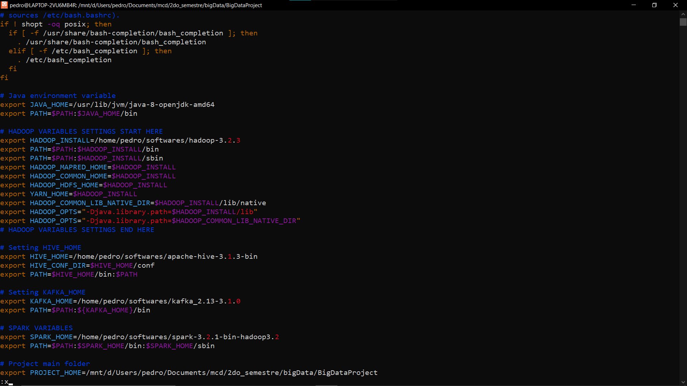

# Proyecto

Una vez instaladas todas las herramientas, estamos listos para comenzar con el proyecto. 

## Configuración de la carpeta de trabajo.

Para poder editar fácilmente los archivos con cualquier editor de texto com por ejemplo Visual Studio Code, crearemos una carpeta dentro del sistema de archivos de Windows en donde almacenaremos el código fuente. En mi caso, llamaré a la carpeta `BigDataProject` en la ruta `D:\Users\pedro\Documents\mcd\2do_semestre\bigData\BigDataProject`


Desde Ubuntu, podemos acceder a cualquiera de nuestros dispositivos de almacenamiento desde la ruta `~/../../mnt/`. Si enlistamos este directorio los podremos ver como carpetas


A partir de ahí puedo enlistar el contenido de mi carpeta `bigData` (directorio padre de la carpeta `BigDataProject`) con el comando `ls ~/../../mnt/d/Users/pedro/Documents/mcd/2do_semestre/bigData/`. Nótese que la ruta es prácticamente la misma que la otorgada por el explorador de archivos de Windows y que la carpeta principal del proyecto se encuentra ahí


Ahora, si nos movemos hasta la carpeta del proyecto con el comando `cd ~/../../mnt/d/Users/pedro/Documents/mcd/2do_semestre/bigData/BigDataProject` y después ejecutamos la instrucción `pwd` imprimiremos la ubicación de la carpeta del proyecto dentro del sistema de archivos de Ubuntu


Añadiremos esta ruta a las variables de entorno del sistema para simplificar los comandos a la hora de ejecutar el código fuente. Abrimos el archivo `~/.basrhc` con el editor de texto con `vim ~/.basrhc` y escribimos la ruta hasta nuestra carpeta del proyecto en la variable de entorno `$PROJECT_HOME`

```bash
# Project main folder
export PROJECT_HOME=/mnt/d/Users/pedro/Documents/mcd/2do_semestre/bigData/BigDataProject
```



Cerramos el archivo, guardamos los cambios y refrescamos las variables de entorno del sistema con el comando `source ~/.bashrc`

## Datos a utilizar 

Se utilizará el archivo `2019-Nov.csv` que es parte del conjunto de datos [eCommerce behavior data for multi category store](https://www.kaggle.com/datasets/mkechinov/ecommerce-behavior-data-from-multi-category-store?select=2019-Nov.csv) de Kaggle. El cual, contiene información del comportamiento de los usuarios dentro de una tienda online en el mes de Noviembre del 2019.

## Preparación del ecosistema

Primero que nada, hay que asegurarnos que las herramientas del ecosistema estén corriendo en nuestra sesión de Ubutnu. Comenzamos con crear una conexión ssh en localhost con los comandos

```bash
sudo service ssh start
ssh localhost
```


Ahora, corremos los daemons de Hadoop con el comando `$HADOOP_INSTALL/sbin/start-all.sh`


Luego, inicializamos el servicio de MySQL con el comando `sudo service mysql start`


Después, nos aseguramos que el servicio de Cassandra se ejecute con el comando `sudo service cassandra restart`


Abrimos dos terminales adicionales de Ubuntu: Una para correr el servidor de Zookeeper y la otra para lanzar el servidor de Kafka (recuerda crear la conexión al localhost con el comando `ssh localhost` en ambas terminales). Primero levantamos Zookeeper con el comando `nohup zookeeper-server-start.sh $KAFKA_HOME/config/zookeeper.properties &` en una terminal y después levantamos Kafka en la otra con el comando `nohup kafka-server-start.sh $KAFKA_HOME/config/server.properties &`. La instrucción `nohup <app> &` permitirtá correr los servidores de Zookeeper y Kafka en segundo plano, por lo que podremos cerrar estas dos terminales adicionales y Kafka seguirá ejecutándose.


Finalmente, abrimos otra terminal, levantamos Anaconda con el comando `eval "$(/home/pedro/anaconda3/bin/conda shell.bash hook)"` (asegúrate de editarlo con la ruta de instalación de Anaconda en tu computadora) y entramos al entorno virtual del proyecto con `conda activate bdp`


## 1. Ingesta de datos: Kafka Producer

Comenzaremos a configurar el bloque de ingesta de datos, para ello, debemos crear un Topic de Kafka para recibir la información y crear las bases de datos en MySQL y Cassandra.

Vamos a crear el topic `ecommercetopic` con el comando `kafka-topics.sh --bootstrap-server localhost:9092 --create --replication-factor 1 --partitions 1 --topic ecommercetopic`


Luego, instalamos el paquete `kafka-python` en el entorno de Anaconda con el comando `conda install -c conda-forge kafka-python -y`


También instalamos el paquete `pandas` con el comando `conda install -c anaconda pandas -y`


El programa del Producer se encuentra en el archivo `BigDataProject/src/kafka_producer.py`

```python
from kafka import KafkaProducer
import json
import pandas as pd
from random import randint
import time
import uuid

# Constants
KAFKA_BOOTSTRAP_SERVERS = 'localhost:9092'
KAFKA_TOPIC_NAME = 'ecommercetopic'
DATA_PATH = '/mnt/d/Users/pedro/Documents/mcd/2do_semestre/bigData/BigDataProject/data/2019-Nov.csv.zip'

# Serializer method
def serializer(data):
    return json.dumps(data).encode('utf-8')

# Producer object
producer = KafkaProducer(
    bootstrap_servers=KAFKA_BOOTSTRAP_SERVERS,
    value_serializer=serializer
)

# Dataframe to simulate real-time data flow
df = pd.read_csv(DATA_PATH, nrows=1000)
df['id'] = df.apply(lambda x: str(uuid.uuid1()), axis=1)
print(len(df.id.unique()))

if __name__ == '__main__':
    while True:
        # Number of messages to send in this iteration
        n_msjs = randint(1, 5)
        # Getting random n_msjs from the dataframe
        sample_df = df.sample(n_msjs, axis=0)
        # Setting a timestamp
        sample_df.event_time = pd.Timestamp.now()
        sample_df.event_time = sample_df.event_time.astype('str')
        # Creating a list of dictionaries from sampled dataframe
        sample = sample_df.to_dict('records')

        # Sending all messages in the sample to Kafka Topic
        for message in sample:
            print(message)
            producer.send(KAFKA_TOPIC_NAME, message)
        # Sleep randomly between 1 and 3 seconds
        time.sleep(randint(1, 3))
```

Para ejecutarlo, corremos el comando `python $PROJECT_HOME/src/kafka_producer.py`. **Nota** verificar que estemos ejecutando el programa desde el entorno virtual de anaconda que fue previamente configurado para este proyecto. Si abrimos una nueva terminal, iniciamos el servicio de ssh, nos conectamos al localhost y ejecutamos un Consumer con el comando `kafka-console-consumer.sh --bootstrap-server localhost:9092 --topic ecommercetopic --from-beginning` podremos verificar que los mensajes enviados desde el script de Python están siendo recibidos por Kafka en su correspondiente topic


En caso de ser necesario, podemos borrar el topic con el comando `kafka-topics.sh --bootstrap-server localhost:9092 --delete --topic ecommercetopic`

## 2. Creación de las bases de datos

Ahora, crearemos una base de datos en Cassandra para almacenar los datos crudos y otra base de datos en MySQL para almacenar los datos procesados.

Para crear la base de datos en Cassandra, creamos una CLI de CQL con el comando `cqlsh --request-timeout=3600` (para evitar TimeOuts) dentro del entorno de Anaconda . Luego, creamos la base de datos `ecommerce_ks` con el comando `CREATE KEYSPACE ecommerce_ks WITH replication = {'class':'SimpleStrategy', 'replication_factor':1};`, después nos movemos a esa base de datos con el comando `USE ecommerce_ks;` y creamos la tabla en donde almacenaremos toda nuestra información con el comando `CREATE TABLE ecommerce_ks.operations (id UUID PRIMARY KEY, event_time text, event_type text, product_id text, category_id text, category_code text, brand text, price float, user_id text, user_session text);`. Podemos verificar que la tabla se ha creado con el comando `DESCRIBE tables;` y tambien podemos revisar su descripción con `DESC ecommerce_ks.operations;`


Ahora crearemos la base de datos en MySQL. Primero entramos a la CLI de MySQL con el comando `sudo mysql`. Una vez dentro, creamos la base de datos para el proyecto con el comando `CREATE DATABASE ecommerce;` y la seleccionamos con el comando `USE ecommerce`. Ahora, creamos la tabla `operations` con el comando `CREATE TABLE operations(id VARCHAR(100) NOT NULL, event_time DATETIME, event_type VARCHAR(20), department VARCHAR(50), product VARCHAR(50), brand VAR CHAR(50), price FLOAT, revenue FLOAT, PRIMARY KEY(id));`. Finalmente, podemos verificar la cración de la tabla con el comando `DESCRIBE operations;`


Ahora, creamos un usuario administrador de esta base de datos con el comando `CREATE USER 'admin'@'localhost' IDENTIFIED BY Admin123.,;`. Después le otorgamos todos los privilegios sobre la base de datos `ecommerce` con el comando `GRANT ALL PRIVILEGES ON ecommerce.* TO 'admin'@'localhost';`. Finalmente, actualizamos los privilegios con el comando `FLUSH PRIVILEGES;`


## 3. Lectura, procesamiento y almacenamiento de los datos

Primero, añadimos algunas variables de entorno para Pyspark en el archivo `~/.bashrc`. Primero, debemos conocer la versión de py4j. Para ello podemos usar el comando `ls -d $SPARK_HOME/python/lib/py4j*`


Una vez sabiendo la versión añadimos las siguientes variables de entorno con el comando `vim ~/.bashrc`

```bash
export PYTHONPATH=$SPARK_HOME/python:$SPARK_HOME/python/lib/py4j-0.10.9.3-src.zip:$PYTHONPATH
export PATH=$SPARK_HOME/bin:$SPARK_HOME/python:$PATH
```


Cerramos el archivo, guardamos todos los cambios y actualizamos las variables de entorno con el comando `source ~/.bashrc`.

Para leer, procesar y almacenar los datos tanto en Cassandra como en MySQL corremos el script `data_processing.py` utilizando Spark con el comando `spark-submit --packages org.apache.spark:spark-sql-kafka-0-10_2.12:3.0.1,com.datastax.spark:spark-cassandra-connector_2.12:3.1.0 $PROJECT_HOME/src/data_processing.py`. 

El parámetro `--packages` se utiliza para cargar al cluster y utilizar las dependencias `spark-sql-kafka` y `spark-cassandra-connector` directamente desde sus servidores.

**Nota** Para que este script actualice las bases de datos es estrictamente necesario que el programa `kafka_producer.py` esté ejecutándose simultaneamente.


