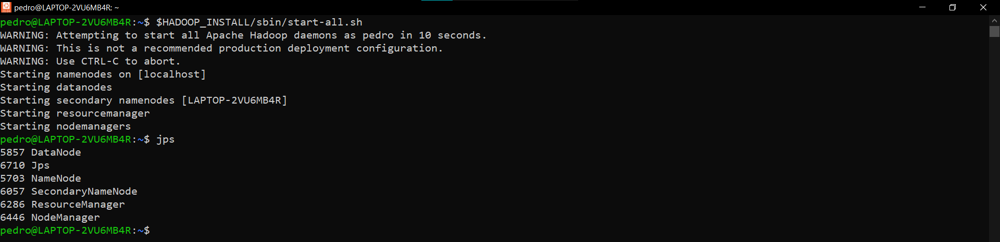

# Proyecto

Una vez instaladas todas las herramientas, estamos listos para comenzar con el proyecto. [insertar aquí un diagramita y la explicación del proyecto]

## Datos a utilizar 

El archivo base a utilizar lleva como nombre `2019-Nov.csv` que es parte del conjunto de datos [eCommerce behavior data for multi category store](https://www.kaggle.com/datasets/mkechinov/ecommerce-behavior-data-from-multi-category-store?select=2019-Nov.csv) de Kaggle. El cual, contiene información del comportamiento de los usuarios dentro de una tienda online en el mes de Noviembre del 2019.

El archivo contiene más de 67 millones de registros y tiene un peso de más de 9 Gb, esto resultó ser demasiado para las computadoras de los integrantes del equipo; por esta razón se generó el archivo `2019-Nov_10KSample.zip` que contiene apenas un diez mil renglones con los que simularemos la producción en tiempo real de datos. Se generó a partir de una muestra estratificada sobre el tipo de acción que los usuarios realizaron (`purchase`, `view` ó `cart`); es decir, el porcentaje original de cada tipo de acción se preserva en la muestra.

Para extraer la muestra se corrió el siguiente script con Pyspark desde la [supercomputadora ACARUS de la Universidad de Sonora](http://acarus.uson.mx/default.htm)

```python
spark = SparkSession.builder.getOrCreate()

df = spark.read.option("header", True).csv("2019-Nov.csv")

df_sample = df.sampleBy("event_type", fractions={'purchase': 0.000148, 'view': 0.000148, 'cart':0.000148}, seed=10)

df_sample.repartition(1).write.option('header', True).csv("2019-Nov_10KSample.csv", sep=',', header=True)
```

## Preparación del ecosistema

### 1. Inicializar la sesión de Ubuntu

Primero que nada, hay que asegurarnos que las herramientas del ecosistema estén corriendo en nuestra sesión de Ubutnu. Comenzamos con crear una conexión ssh en localhost con los comandos

```bash
sudo service ssh start
ssh localhost
```


### 2. Inicializar los daemons de Hadoop

Para ello, utilizamos el comando `$HADOOP_INSTALL/sbin/start-all.sh` y después nos aseguramos de que los daemons se encuentren corriendo con el comando `jps`




### 3. Inicializar el servicio de MySQL

Luego, inicializamos el servicio de MySQL con el comando `sudo service mysql start`


### 4. Inicializar el servicio de Apache Cassandra

Después, nos aseguramos que el servicio de Cassandra se ejecute con el comando `sudo service cassandra restart`


## 5. Levantar Apache Superset

Ahora, vamos a correr Superset en una terminal dedicada. Para ello, la abrimos, nos conectamos al localhost con `ssh localhost`, inicializamos Anaconda con `eval "$(/home/pedro/anaconda3/bin/conda shell.bash hook)"`, activamos el entorno de Superset con `conda activate superset` y levantamos la aplicación con `superset run --with-threads`.


## 6. Levantar los servidores de Zookeeper y Kafka

Abrimos dos terminales adicionales de Ubuntu: Una para correr el servidor de Zookeeper y la otra para lanzar el servidor de Kafka (recuerda crear la conexión al localhost con el comando `ssh localhost` en ambas terminales). Primero levantamos Zookeeper con el comando `nohup zookeeper-server-start.sh $KAFKA_HOME/config/zookeeper.properties &` en una terminal y después levantamos Kafka en la otra con el comando `nohup kafka-server-start.sh $KAFKA_HOME/config/server.properties &`. La instrucción `nohup <app> &` permitirtá correr los servidores de Zookeeper y Kafka en segundo plano, por lo que podremos cerrar estas dos terminales adicionales y Kafka seguirá ejecutándose. En caso de no utilizar dichas opciones correran normalmente


## 7. Correr el Job de Spark para el procesamiento y almacenamiento de los datos 

Primero abrimos una terminal y nos conectamos al localhost con el comando `ssh localhost`. Para leer, procesar y almacenar los datos tanto en Cassandra como en MySQL corremos el script `data_processing.py` utilizando Spark con el comando `spark-submit --packages org.apache.spark:spark-sql-kafka-0-10_2.12:3.0.1,com.datastax.spark:spark-cassandra-connector_2.12:3.1.0 --jars /usr/share/java/mysql-connector-java-8.0.28.jar $PROJECT_HOME/src/data_processing.py`. 

* El parámetro `--packages` se utiliza para cargar al cluster y utilizar las dependencias `spark-sql-kafka` y `spark-cassandra-connector` directamente desde sus servidores web.
* El parámetro `--jars` especifica el path hacia el conector de MySQL para Java.

El script a ejecutar es el siguiente:

```python
from pyspark.sql import SparkSession
from pyspark.sql.functions import *
from pyspark.sql.types import *

import time

# Kafka constants
KAFKA_TOPIC_NAME = 'ecommercetopic'
KAFKA_BOOTSTRAP_SERVERS = 'localhost:9092'

# MySQL constants
MYSQL_HOST_NAME='localhost'
MYSQL_PORT='3306'
MYSQL_DATABASE='ecommerce'
MYSQL_TABLE='operations'
MYSQL_USR_NAME='admin'
MYSQL_PASSWORD='Admin123.,'
MYSQL_JDBC_URL=f'jdbc:mysql://{MYSQL_HOST_NAME}:{MYSQL_PORT}/{MYSQL_DATABASE}'
MYSQL_DRIVER_CLASS='com.mysql.cj.jdbc.Driver'

# Cassandra Constants
CASSANDRA_HOST_NAME = 'localhost'
CASSANDRA_PORT = '9042'
CASSANDRA_KEYSPACE='ecommerce_ks'
CASSANDRA_TABLE = 'operations'

def save_to_cassandra(current_df, epoch_id):
    '''
        This method update the Cassandra table.

        Params
        ------
        - current_df: Latest raw dataframe
        - epoch_id: Latest epoch number

        Returns
        -------
        None
    '''
    print('Saving to Cassandra')

    current_df \
        .write \
        .format('org.apache.spark.sql.cassandra') \
        .mode('append') \
        .options(table=CASSANDRA_TABLE, keyspace=CASSANDRA_KEYSPACE) \
        .save()

def save_to_mysql(current_df, epoch_id):
    '''
        This method update the MySQL table.

        Params
        ------
        - current_df: Latest raw dataframe
        - epoch_id: Latest epoch number

        Returns
        -------
        None
    '''
    db_credentials = {
        'user': MYSQL_USR_NAME,
        'password': MYSQL_PASSWORD,
        'driver': MYSQL_DRIVER_CLASS
    }

    print('Saving to Mysql')
    current_df \
        .write \
        .jdbc(
            url=MYSQL_JDBC_URL,
            table=MYSQL_TABLE,
            mode='append',
            properties=db_credentials
        )

if __name__ == '__main__':
    print('Data Processing application started')
    print(time.strftime("%Y-%m-%d %H:%M:%S"))

    # Creating a Spark Session
    spark = SparkSession \
            .builder \
            .appName('Pyspark structured streaming') \
            .master('local[*]') \
            .getOrCreate()
    spark.sparkContext.setLogLevel('ERROR')

    # Extracting information from Kafka topic
    kafka_stream = spark \
        .readStream \
        .format('kafka') \
        .option('kafka.bootstrap.servers', KAFKA_BOOTSTRAP_SERVERS) \
        .option('subscribe', KAFKA_TOPIC_NAME) \
        .option('startingOffsets', 'latest') \
        .load()
    raw_info = kafka_stream.selectExpr("CAST(key AS STRING)", "CAST(value AS STRING)")

    # Building a Schema (columns and their types) to the information
    # retrieved
    df_schema = StructType() \
            .add('id', StringType()) \
            .add('event_time', StringType()) \
            .add('event_type', StringType()) \
            .add('product_id', StringType()) \
            .add('category_id', StringType()) \
            .add('category_code', StringType()) \
            .add('brand', StringType()) \
            .add('price', FloatType()) \
            .add('user_id', StringType()) \
            .add('user_session', StringType())
    
    # Application of the schema to the information retrieved
    df_raw = raw_info \
        .select(from_json(col('value'), df_schema).alias('dataframe'))
    df_raw = df_raw.select('dataframe.*')

    # Storing raw data into Cassandra database
    df_raw \
        .writeStream \
        .trigger(processingTime='15 seconds') \
        .outputMode('update') \
        .foreachBatch(save_to_cassandra) \
        .start()
    
    # ----- DATA PREPROCESSING -----

    # Removing useless columns
    df = df_raw.drop('product_id', 'category_id', 'user_id', 'user_session')\
    # Splitting 'category_code' to find the department and product
    split_col = split(df['category_code'], '\.')
    df = df.withColumn('department', element_at(split_col, 1))
    df = df.withColumn('product', element_at(split_col, -1))
    # Removing column 'category_code'
    df = df.drop('category_code')
    # Creating revenue column
    df = df.withColumn('revenue', when(df.event_type=='purchase', df.price).otherwise(0))
    # Filling nans in 'brand', 'department' and 'product' columns
    for c in ['brand', 'department', 'product']:
        df = df.withColumn(c, regexp_replace(c, 'NaN', 'other'))
    
    # Storing processed dataframe into MySQL database
    df \
        .writeStream \
        .trigger(processingTime='15 seconds') \
        .outputMode('update') \
        .foreachBatch(save_to_mysql) \
        .start() \
        .awaitTermination()
```

Como todavía no hemos enviado ningún mensaje hacia el topic de Kafka, este job se quedará en Standby esperando a recibir datos para procesarlos y almacenarlos.


### 8. Lanzar el Kafka producer

Finalmente, abrimos otra terminal. Nos conectamos al localhost con `ssh localhost`, levantamos Anaconda con el comando `eval "$(/home/pedro/anaconda3/bin/conda shell.bash hook)"` y entramos al entorno virtual del Kafka producer con `conda activate producer`


El script `kafka_producer.py` que se encuentra en el directorio del proyecto es el que se encargará de simular un flujo de datos en tiempo real

```python
from kafka import KafkaProducer
import json
import pandas as pd
from random import randint
import time
import uuid

# Constants
KAFKA_BOOTSTRAP_SERVERS = 'localhost:9092'
KAFKA_TOPIC_NAME = 'ecommercetopic'
DATA_PATH = '/mnt/d/Users/pedro/Documents/mcd/2do_semestre/bigData/BigDataProject/data/2019-Nov_10KSample.zip'

# Serializer method
def serializer(data):
    return json.dumps(data).encode('utf-8')

# Producer object
producer = KafkaProducer(
    bootstrap_servers=KAFKA_BOOTSTRAP_SERVERS,
    value_serializer=serializer
)

# Dataframe to simulate real-time data flow
df = pd.read_csv(DATA_PATH)

if __name__ == '__main__':
    while True:
        # Number of messages to send in this iteration
        n_msjs = randint(1, 10)
        # Getting random n_msjs from the dataframe
        sample_df = df.sample(n_msjs, axis=0)
        # Setting a timestamp
        sample_df.event_time = pd.Timestamp.now()
        sample_df.event_time = sample_df.event_time.astype('str')
        # Setting a unique ID
        sample_df['id'] = df.apply(lambda x: str(uuid.uuid1()), axis=1)
        # Creating a list of dictionaries from sampled dataframe
        sample = sample_df.to_dict('records')

        # Sending all messages in the sample to Kafka Topic
        for message in sample:
            print(message)
            producer.send(KAFKA_TOPIC_NAME, message)
        # Sleep randomly between 1 and 3 seconds
        time.sleep(randint(1, 3))
```

Lo ejecutamos con el comando `python $PROJECT_HOME/src/kafka_producer.py`. Al cabo de unos segundos podremos ver que comienzan a enviarse datos, al mismo tiempo, el job de Spark nos indicará que ha comenzado a almacenar datos tanto en MySQL como en Cassandra


Ahora, podemos revisar el Dashboard que hayamos creado. Por ejemplo, realicé un primer chequeo a las **12:34 AM** y la información de la página principal era la siguiente


Unos minutos después, a las **12:37 AM** Refresqué el dashboard y obtuve resultados actualizados


De hecho, podemos asignar un intervalo de tiempo para que el Dashboard se refresque automáticamente desde la opción `Set auto-refresh interval`


Ahora, vistazo a cada pestaña de nuestro modesto pero informativo Dashboard


